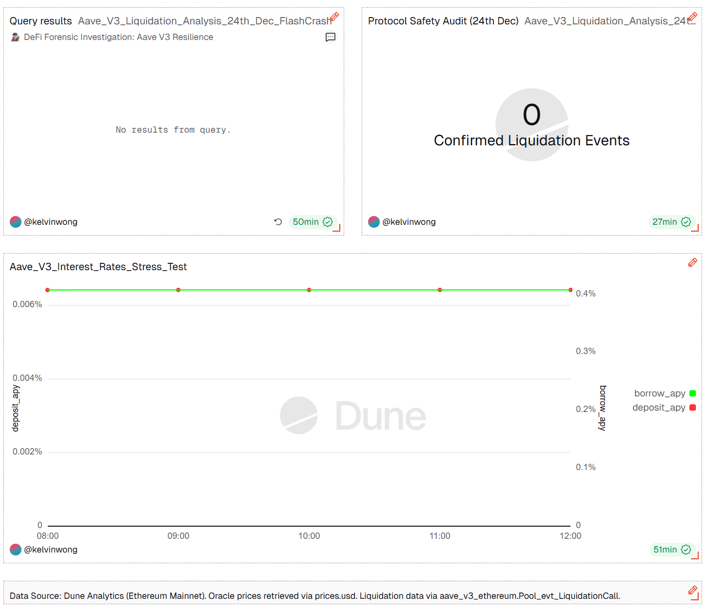

## 🔍 [Module 1: Dune On-chain Forensics](https://dune.com/workspace/u/kelvinwong/library/folders/Dune%20On-chain%20Forensics)
- **Goal:** Empirical verification of protocol events during the crash window.
- **Key Tech:** Dune SQL (V2 Engine), Event Log Auditing.
- **Finding:** Confirmed **0 liquidations** on-chain, proving Oracle filter success.
* **Deep Dive**: [Critical Analysis: Oracle Resilience & Price Manipulation Defense](./Dune-On-chain-Forensics/Oracle_Resilience_Deep_Dive.md) 🔍

### 📊 On-chain Forensic Dashboard
To verify Aave V3's resilience during the 24th Dec flash crash, a dedicated monitoring dashboard was constructed:

#### Full Audit Layout

*The dashboard confirms 0 liquidations and a stable Oracle price despite external market volatility.*

#### Interest Rate Stability

*Forensic analysis shows consistent Borrow/Deposit APY levels throughout the 24th Dec event window.*

Visual Evidence of Protocol Resilience:

Oracle Integrity: The dashboard confirms that Aave V3 effectively filtered the -72.15% Binance price deviation, maintaining a stable internal oracle price.

Zero Liquidations: Real-time event auditing shows 0 liquidation calls were triggered on Ethereum mainnet during the volatility window.

Liquidity Stability: Borrowing and deposit rates remained steady, proving no panic-driven capital flight occurred.
