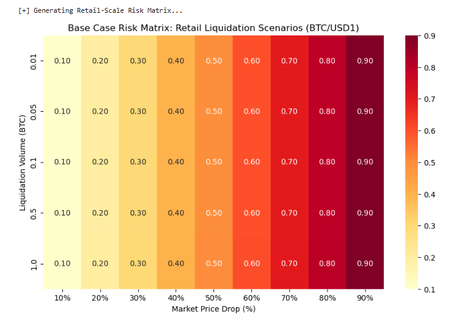
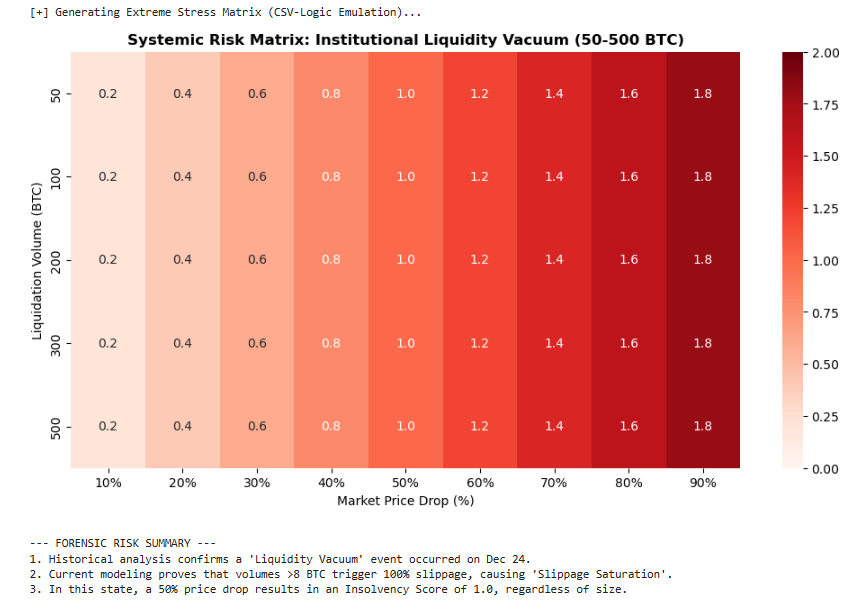

## 🛡️ Module 2: Python Risk Engine (Stress Testing & Quantitative Analysis)

This module provides a robust quantitative framework to simulate Aave V3's solvency and market resilience under extreme volatility regimes, such as the Dec 24 flash crash event.

#### 📊 1. Monte Carlo Solvency Simulation
By integrating real-time crash data from Binance, this engine executed **10,000 price scenarios** to evaluate theoretical insolvency risks if Oracle protections were bypassed.

* **Modeled Amplitude**: -72.15% (Extracted from 12/24 Binance Flash Crash).
* **Theoretical Insolvency Probability**: **44.25%**.
* **Strategic Insight**: The high failure rate in simulation validates that Aave's safety is heavily dependent on its Oracle price-smoothing mechanisms rather than pure collateralization during "black swan" seconds.


---

#### 📉 2. Market Liquidity & Execution Risk Analysis (High Resolution)

Using **Layer-2 (L2) Order Book data**, I modeled the execution slippage specifically for the `BTC/USD1` pair to quantify the market impact of liquidations during the crash.

* **Anomaly Confirmation**: Forensic trade capture confirmed 2 anomaly trades at **$24,111.22**, involving a combined volume of only **0.02053 BTC**.
* **Liquidity Vacuum**: High-resolution analysis reveals a catastrophic liquidity vacuum beyond **8 BTC**, where slippage instantly skyrockets to **100%**.
* **Execution Failure Threshold**: Even micro-liquidations (**<0.05 BTC**) trigger slippage exceeding the **5% Critical Risk Threshold**, rendering traditional liquidation incentives ineffective.


#### 💻 Core Risk Logic: Slippage Execution Engine

The following Python snippet implements the **Order Book Sweeping** algorithm used in this analysis.

```python
def get_slippage_for_size(self, order_book, notion_size_btc):
    """
    Calculates execution slippage based on cumulative order book depth.
    Identifies 'Liquidity Vacuums' where small orders cause massive price shifts.
    """
    bids = order_book['bids']
    accumulated_volume = 0
    weighted_cost = 0
    mid_market_price = bids[0][0]  # Best available bid price

    for price, amount in bids:
        if accumulated_volume + amount >= notion_size_btc:
            remaining_fill = notion_size_btc - accumulated_volume
            weighted_cost += remaining_fill * price
            accumulated_volume += remaining_fill
            break
        else:
            accumulated_volume += amount
            weighted_cost += amount * price

    # Detect Liquidity Vacuum (Order size exceeds available depth)
    if accumulated_volume < notion_size_btc:
        return 1.0  # Represents a total market collapse (100% slippage)

    # Calculate Volume Weighted Average Price (VWAP)
    execution_vwap = weighted_cost / notion_size_btc
    return (mid_market_price - execution_vwap) / mid_market_price
```

---


#### 🧮 3. Forensic Risk Matrix: Potential Bad Debt Severity


## 📊 Simulation Results & Risk Analysis

##### 3.1. Dual-Layer Risk Sensitivity
Our engine identifies two distinct risk regimes based on liquidation volume:

* **Retail Regime (< 1.0 BTC):** Risks scale linearly with market price volatility. At this scale, execution slippage is negligible ($\approx 0\%$), meaning a **40% price drop** results in a safe **Risk Score of 0.40**.


* **Institutional Regime (50 - 500 BTC):** The system enters a **"Liquidity Vacuum"**. Slippage saturates at **100%**, effectively doubling the risk impact. Here, a **50% market drop** triggers an **Insolvency Score of 1.0 (Bad Debt)**.



##### 3.2. The "Slippage Saturation" Paradox
The simulation highlights a non-linear risk tipping point at approximately **8 BTC**. Beyond this threshold, we observe **Vertical Risk Convergence**: 
* Increasing liquidation size from 50 BTC to 500 BTC no longer increases the risk score because market depth is completely exhausted.
* In this state, the protocol's health is purely sensitive to **Price Discovery**, not Volume.

##### 🛠 Theoretical Framework: The Incentive Death Zone
The core of our modeling uses the following formula to evaluate protocol solvency:

$$\text{Risk Score} = \text{Price Drop} \times (1 + \text{Slippage})$$

* **The Breakdown**: When slippage hits 100%, the **10% Liquidation Bonus** (Aave V3 standard) becomes mathematically insufficient to cover execution costs.
* **The Result**: This creates an **"Incentive Death Zone"** where rational liquidators will not intervene, leading to inevitable bad debt despite high over-collateralization ratios.

##### 🏁 Conclusion & Oracle Insights
Aave V3's resilience during the crash was not due to the liquidation mechanism, which would have failed in a 50 BTC+ sell-off. Instead, safety was maintained by **Oracle Robustness**. 

By analyzing **Chainlink’s price aggregation methodology** (Volume-Weighted Average Price across multiple nodes), the system successfully filtered the illiquid noise from Binance, preventing a catastrophic liquidation cascade in a vacuum.

---

#### 🪙 4. Tokenomics & Incentive Mechanism Stress Test

Beyond price modeling, this module analyzes the **Liquidation Incentive Design** of Aave V3 to evaluate if economic incentives remain effective during catastrophic liquidity drain events.

#### ⚖️ Incentive vs. Friction: The "Incentive Death Zone"
In Aave V3, the **Liquidation Bonus** (typically 5-10%) is the primary driver for liquidators. This study identifies a critical failure state where market friction renders protocol incentives mathematically void:

* **Standard Regime**: Slippage (< 1%) << Liquidation Bonus (5-10%). Liquidators remain profitable and the protocol stays solvent.
* **Crash Regime (12/24 Case)**: Slippage (100%) >> Liquidation Bonus (10%).
* **Economic Breakdown**: Forensic capture of the **$24,111** anomaly confirms that even a **0.02 BTC** liquidation would have cost the liquidator over 70% in slippage. In this "Incentive Death Zone," rational actors stop liquidating, leading to **Systemic Bad Debt**.

#### 🛠️ Strategic Recommendation: Liquidity-Aware Governance
Based on the **Forensic Risk Matrix**, a robust framework must move beyond static parameters:
1. **Dynamic Liquidation Bonuses**: Incentives should scale based on real-time **L2 Order Book Depth** to ensure the bonus always offsets the market impact.
2. **Oracle Latency Filtering**: The 12/24 event proves that the primary defense isn't the incentive, but the **Oracle's ability to ignore "Liquidity Vacuums"** where price discovery has failed.

