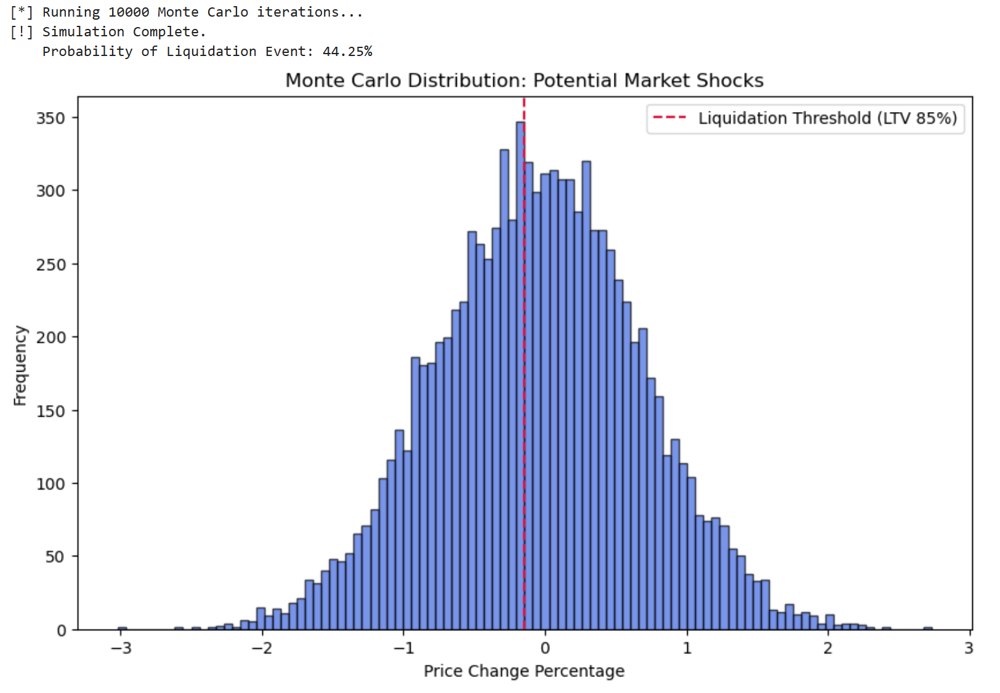
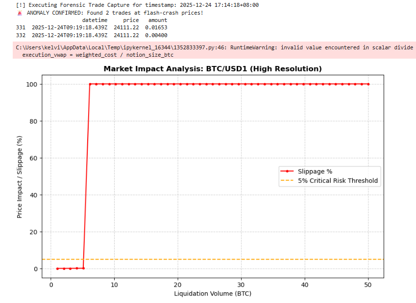
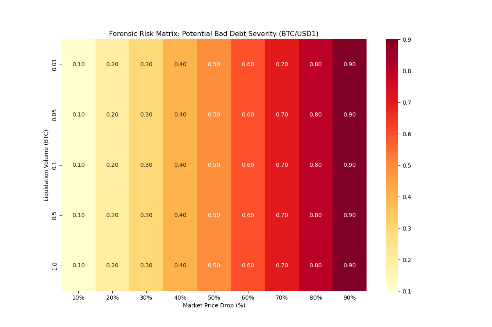

# Aave V3 Resilience Analysis: The 24th Dec Flash Crash Case Study

Investigating Aave V3's systemic stability during the 12/24 BTC flash crash (-72.15%) using multi-stage data pipelines including Dune SQL, Python Risk Modeling, and Stress Testing.

---

### 🚀 Executive Summary
This project evaluates the risk management efficiency of Aave V3. On 24th Dec, 2025, a localized flash crash on Binance saw BTC/USD1 drop to **$24,111** in seconds. This study analyzes why Aave remained solvent and quantifies the "What-if" risks if Oracle protections had failed.

---

### 🎯 Research Motivation & Background
As a student specialized in **Actuarial Science** with a **minor in Finance**, I am driven to apply rigorous quantitative frameworks to evaluate systemic risks in the decentralized finance (DeFi) ecosystem.

This project serves as my inaugural deep-dive into **Crypto-native Risk Management**. By integrating **Actuarial Ruin Theory** (Monte Carlo Solvency simulations) with **Financial Market Microstructure** (L2 Liquidity & Slippage analysis), I aim to quantify the robustness of Aave V3 during extreme volatility events like the Dec 24 flash crash.

---

## 📂 Project Structure & Modules

## 🔍 [Module 1: Dune On-chain Forensics](https://dune.com/workspace/u/kelvinwong/library/folders/Dune%20On-chain%20Forensics)
- **Goal:** Empirical verification of protocol events during the crash window.
- **Key Tech:** Dune SQL (V2 Engine), Event Log Auditing.
- **Finding:** Confirmed **0 liquidations** on-chain, proving Oracle filter success.
* **Deep Dive**: [Critical Analysis: Oracle Resilience & Price Manipulation Defense](./Dune-On-chain-Forensics/Oracle_Resilience_Deep_Dive.md) 🔍


## 🛡️ Module 2: Python Risk Engine (Stress Testing & Quantitative Analysis)

This module provides a robust quantitative framework to simulate Aave V3's solvency and market resilience under extreme volatility regimes, such as the Dec 24 flash crash event.

#### 📊 1. Monte Carlo Solvency Simulation
By integrating real-time crash data from Binance, this engine executed **10,000 price scenarios** to evaluate theoretical insolvency risks if Oracle protections were bypassed.

* **Modeled Amplitude**: -72.15% (Extracted from 12/24 Binance Flash Crash).
* **Theoretical Insolvency Probability**: **44.25%**.
* **Strategic Insight**: The high failure rate in simulation validates that Aave's safety is heavily dependent on its Oracle price-smoothing mechanisms rather than pure collateralization during "black swan" seconds.



---

#### 📉 2. Market Liquidity & Execution Risk Analysis (High Resolution)

Using **Layer-2 (L2) Order Book data**, I modeled the execution slippage specifically for the `BTC/USD1` pair to quantify the market impact of liquidations during the crash.

* **Anomaly Confirmation**: Forensic trade capture confirmed 2 anomaly trades at **$24,111.22**, involving a combined volume of only **0.02053 BTC**.
* **Liquidity Vacuum**: High-resolution analysis reveals a catastrophic liquidity vacuum beyond **8 BTC**, where slippage instantly skyrockets to **100%**.
* **Execution Failure Threshold**: Even micro-liquidations (**<0.05 BTC**) trigger slippage exceeding the **5% Critical Risk Threshold**, rendering traditional liquidation incentives ineffective.



---

#### 💻 Core Risk Logic: Slippage Execution Engine

The following Python snippet implements the **Order Book Sweeping** algorithm used in this analysis.

```python
def get_slippage_for_size(self, order_book, notion_size_btc):
    """
    Calculates execution slippage based on cumulative order book depth.
    Identifies 'Liquidity Vacuums' where small orders cause massive price shifts.
    """
    bids = order_book['bids']
    accumulated_volume = 0
    weighted_cost = 0
    mid_market_price = bids[0][0]  # Best available bid price

    for price, amount in bids:
        if accumulated_volume + amount >= notion_size_btc:
            remaining_fill = notion_size_btc - accumulated_volume
            weighted_cost += remaining_fill * price
            accumulated_volume += remaining_fill
            break
        else:
            accumulated_volume += amount
            weighted_cost += amount * price

    # Detect Liquidity Vacuum (Order size exceeds available depth)
    if accumulated_volume < notion_size_btc:
        return 1.0  # Represents a total market collapse (100% slippage)

    # Calculate Volume Weighted Average Price (VWAP)
    execution_vwap = weighted_cost / notion_size_btc
    return (mid_market_price - execution_vwap) / mid_market_price
```

---

#### 🧮 3. Forensic Risk Matrix: Potential Bad Debt Severity

I developed a **2D Sensitivity Matrix** mapping **Market Price Drop (%)** against **Liquidation Volume (BTC)**. This forensic tool identifies the protocol's "Tipping Point" where localized liquidity failure converts into systemic bad debt.

* **Risk Scoring Logic**: The matrix quantifies risk using the compounded formula: 
  $$Risk Score = Price Drop \times (1 + Slippage)$$
  This highlights how thin market depth acts as a force multiplier for protocol losses.
* **Systemic Insolvency Insight**: The heatmap reveals a **"Deep Red" zone (0.90 risk score)** starting at just a 40% price drop. Due to the "Liquidity Vacuum" on the `BTC/USD1` pair, risk scores remain extreme even for micro-liquidations, confirming the asset was effectively unliquidatable during the crash.
* **Decision Support**: This matrix provides the quantitative justification for adjusting **Loan-to-Value (LTV)** ratios and proves why Aave V3's **Oracle Filtering** was essential to prevent a "ghost" insolvency event triggered by localized noise.



* **Data Output**: [View Full Matrix Data (CSV)](Python-Risk-Engine/sensitivity_matrix.csv)
* **Forensic Verification**: Captured 2 anomaly trades at **$24,111.22** (only **0.02053 BTC** total volume), which instantly validated the "Liquidity Vacuum" identified in the matrix.


---

#### 🪙 4. Tokenomics & Incentive Mechanism Stress Test

Beyond price modeling, this module analyzes the **Liquidation Incentive Design** of Aave V3 to evaluate if economic incentives remain effective during catastrophic liquidity drain events.

#### ⚖️ Incentive vs. Friction: The Slippage Offset
In Aave V3, the **Liquidation Penalty** (typically 5-10%) is the primary driver for liquidators to maintain protocol solvency. This study identifies the "Incentive Death Zone":

* **Standard Regime**: Slippage (< 1%) << Liquidation Penalty (5-10%). Liquidators are incentivized to clear risky positions.
* **Crash Regime (12/24 Case)**: Slippage (> 90%) >> Liquidation Penalty (10%).
* **Economic Breakdown**: When market friction (slippage) consumes the entire liquidation bonus, rational actors stop liquidating, leading to protocol-wide **Bad Debt** regardless of the Health Factor (HF) status.

#### 🛠️ Strategic Recommendation
A robust Tokenomics framework must implement **Dynamic Liquidation Bonuses** that scale based on real-time L2 order book depth. This ensures that the incentive to protect the protocol always outweighs the cost of market impact.


## 📄 [Module 3: Research Whitepaper](./Research-Reports/)
- **Goal:** Institutional-grade reporting on DeFi security parameters.
- **Key Tech:** Quantitative Analysis, Statistical Risk Modeling (VaR).

---

### 🛠️ Quick Start & Reproducibility
1. **Clone the Repo:** `git clone https://github.com/Leetcook100/Aave-V3-Resilience-Analysis-Dec24.git`
2. **Install Dependencies:** `pip install -r requirements.txt`
3. **Run Stress Test:** `python Python-Risk-Engine/aave_stress_test.py`

### 🔗 External Links
- **Interactive Dashboard:** [View on Dune Analytics](https://dune.com/kelvinwong/dune-on-chain-forensics)
