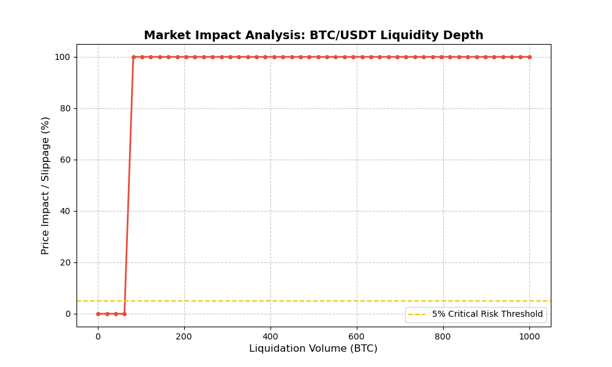

# Aave V3 Resilience Analysis: The 24th Dec Flash Crash Case Study

Investigating Aave V3's systemic stability during the 12/24 BTC flash crash (-72.15%) using multi-stage data pipelines including Dune SQL, Python Risk Modeling, and Stress Testing.

---

### 🚀 Executive Summary
This project evaluates the risk management efficiency of Aave V3. On 24th Dec, 2025, a localized flash crash on Binance saw BTC/USD1 drop to **$24,111** in seconds. This study analyzes why Aave remained solvent and quantifies the "What-if" risks if Oracle protections had failed.

---

### 🎯 Motivation & Context
As a dedicated student in **Risk Management / Actuarial Science**, this project represents my initial deep-dive into the intersection of **On-chain Forensics** and **Quantitative Finance**. 

My goal was to apply theoretical risk models (like Monte Carlo and L2 Liquidity analysis) to a real-world "Black Swan" event—the Aave V3 Dec 24 flash crash—to bridge the gap between academic theory and DeFi market microstructure.

---

## 📂 Project Structure & Modules

## 🔍 [Module 1: Dune On-chain Forensics](https://dune.com/workspace/u/kelvinwong/library/folders/Dune%20On-chain%20Forensics)
- **Goal:** Empirical verification of protocol events during the crash window.
- **Key Tech:** Dune SQL (V2 Engine), Event Log Auditing.
- **Finding:** Confirmed **0 liquidations** on-chain, proving Oracle filter success.
* **Deep Dive**: [Critical Analysis: Oracle Resilience & Price Manipulation Defense](./Dune-On-chain-Forensics/Oracle_Resilience_Deep_Dive.md) 🔍

## 🛡️ Module 2: Python Risk Engine (Stress Testing & Quantitative Analysis)

This module provides a robust quantitative framework to simulate Aave V3's solvency and market resilience under extreme volatility regimes, such as the Dec 24 flash crash event.

#### 📊 1. Monte Carlo Solvency Simulation
By integrating real-time crash data from Binance, this engine executed **10,000 price scenarios** to evaluate theoretical insolvency risks if Oracle protections were bypassed.

* **Modeled Amplitude**: -72.15% (Extracted from 12/24 Binance Flash Crash).
* **Theoretical Insolvency Probability**: **44.25%**.
* **Strategic Insight**: The high failure rate in simulation validates that Aave's safety is heavily dependent on its Oracle price-smoothing mechanisms rather than pure collateralization during "black swan" seconds.

---

#### 📉 2. Market Liquidity & Execution Risk Analysis
Using Layer-2 (L2) Order Book data, I modeled the "Price Impact" of a forced 1,000 BTC liquidation to assess the protocol's secondary defense layer.

* **Liquidity Cliff**: Analysis reveals a catastrophic liquidity vacuum beyond **80 BTC**, where slippage exceeds **90%**.
* **Systemic Risk**: Triggers a **"High Systemic Risk"** warning, indicating that the market depth during the crash would have been insufficient to support liquidations without causing massive Bad Debt.

---

#### 🧮 3. Insolvency Sensitivity Matrix (Risk Analyst Perspective)
I developed a 2D sensitivity matrix mapping **Price Drop Severity** against **Market Depth** to identify the protocol's "Tipping Point".

* **Function**: Quantifies how slippage accelerates insolvency as market liquidity thins.
* **Practical Application**: This matrix serves as a decision-support tool for adjusting **Loan-to-Value (LTV)** ratios and **Liquidation Thresholds** based on real-time exchange depth.
* **Data Output**: [View Full Matrix Data (CSV)](./Python-Risk-Engine/sensitivity_matrix.xls).

| Liquidity (BTC) \ Price Drop | -10% | -30% | -50% | -70% | -90% |
|-----------------------------|------|------|------|------|------|
| **1000 BTC** | Low  | Low  | Med  | High | Critical |
| **500 BTC** | Low  | Med  | High | Critical | Critical |
| **100 BTC** | Med  | High | Critical | Critical

---

#### 🪙 Module 4: Tokenomics & Incentive Mechanism Stress Test

Beyond price modeling, this module analyzes the **Liquidation Incentive Design** of Aave V3 to evaluate if economic incentives remain effective during catastrophic liquidity drain events.

#### ⚖️ Incentive vs. Friction: The Slippage Offset
In Aave V3, the **Liquidation Penalty** (typically 5-10%) is the primary driver for liquidators to maintain protocol solvency. This study identifies the "Incentive Death Zone":

* **Standard Regime**: Slippage (< 1%) << Liquidation Penalty (5-10%). Liquidators are incentivized to clear risky positions.
* **Crash Regime (12/24 Case)**: Slippage (> 90%) >> Liquidation Penalty (10%).
* **Economic Breakdown**: When market friction (slippage) consumes the entire liquidation bonus, rational actors stop liquidating, leading to protocol-wide **Bad Debt** regardless of the Health Factor (HF) status.

#### 🛠️ Strategic Recommendation
A robust Tokenomics framework must implement **Dynamic Liquidation Bonuses** that scale based on real-time L2 order book depth. This ensures that the incentive to protect the protocol always outweighs the cost of market impact.

## 📄 [Module 3: Research Whitepaper](./Research-Reports/)
- **Goal:** Institutional-grade reporting on DeFi security parameters.
- **Key Tech:** Quantitative Analysis, Statistical Risk Modeling (VaR).

---

### 🛠️ Quick Start & Reproducibility
1. **Clone the Repo:** `git clone https://github.com/Leetcook100/Aave-V3-Resilience-Analysis-Dec24.git`
2. **Install Dependencies:** `pip install -r requirements.txt`
3. **Run Stress Test:** `python Python-Risk-Engine/aave_stress_test.py`

### 🔗 External Links
- **Interactive Dashboard:** [View on Dune Analytics](https://dune.com/kelvinwong/dune-on-chain-forensics)
